# Ejecución del código

para ejecutar el código lo primero es instalar pip-tools

```
pip install pip-tools
```

compilamos los requierements

```
pip-compile requirements.in
```

instalamos los requirements generados

```
pip install -r requirements.txt
```

Servimos el mflow en el puerto 8004

```
mlflow server --host 127.0.0.1 --port 8084
```

ejecuatos todo el pipeline

```
python main.py
```

# Ingeniería de características

## datasets offers.csv

En el proceso inicial del entrenamiento del modelo, se llevó a cabo la ingeniería de características como primer paso. Para esto, se realizaron tres análisis exploratorios con el objetivo de comprender las características del negocio. En primer lugar, se examinó el conjunto de datos, realizando un análisis detallado de cada columna y su posible relación con la variable predictora.

### Status

El enfoque inicial consistió en analizar la variable objetivo, donde se procedió a examinar todas las clases disponibles. Como resultado de este análisis, se tomó la decisión de mantener las clases "Closed Won" y "Closed Loss". Esta elección se basó en la capacidad de estas clases para describir de manera precisa el objetivo del modelo, que es proporcionar un puntaje que varía entre 0 y 1. En este contexto, el valor 0 representa la probabilidad de perder un cierre, mientras que el valor 1 indica la probabilidad de lograr un cierre exitoso. Este enfoque busca optimizar la capacidad del modelo para realizar un scoring efectivo en la clasificación de oportunidades de negocio.

**Title: Distribución de la variable status**

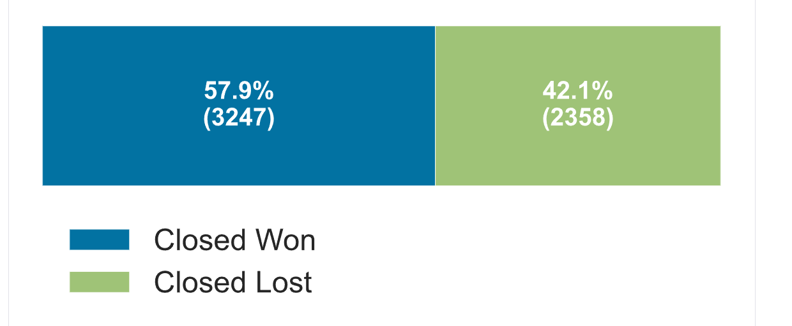

Tras realizar este proceso, se observó que el 57.9% de las instancias pertenecían a la clase "Closed Won" y el 42.1% a la clase "Closed Loss". Este equilibrio en la distribución de clases indicó que no existía un desbalanceo significativo en los datos. Con esta consideración, se procedió a eliminar los datos relacionados con la otra clase, consolidando así un conjunto de datos más enfocado y representativo para el objetivo del modelo.

### Use Case

La segunda variable analizada fue "use_case". Este análisis proporcionó una comprensión más profunda del caso de uso de la plataforma. Los resultados indicaron una fuerte asociación con eventos corporativos. En consecuencia, se tomó la decisión de crear una variable binaria para clasificar los casos como eventos corporativos y eventos no corporativos. Esta nueva variable binaria se introdujo con el objetivo de capturar y reflejar de manera más efectiva la naturaleza específica de los eventos corporativos en relación con el rendimiento del modelo.

**Title: Distribución de la variable use case**

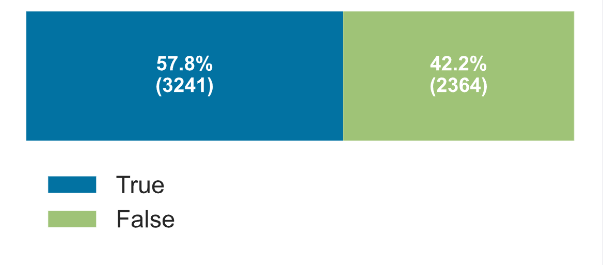

La evaluación de la variable "use_case" reveló que no existía un desbalanceo significativo, y se destacó su predominante aplicación en eventos corporativos.

### Precio

Posteriormente, la atención se centró en la variable de "precio". Durante el análisis, se identificaron varios valores iguales a cero, sugiriendo que algunos clientes habían obtenido servicios de manera gratuita. Aunque la distribución de esta variable mostraba un sesgo hacia la izquierda, se determinó que no tenía un impacto sustancial en la métrica de AUC, la cual se explicará más adelante por qué fue seleccionada como métrica principal. Se realizaron pruebas con correcciones utilizando logaritmos y normalización, sin embargo, se observó que estas modificaciones no generaban cambios significativos en la métrica AUC.

**Title: Distribución de la variable precio**

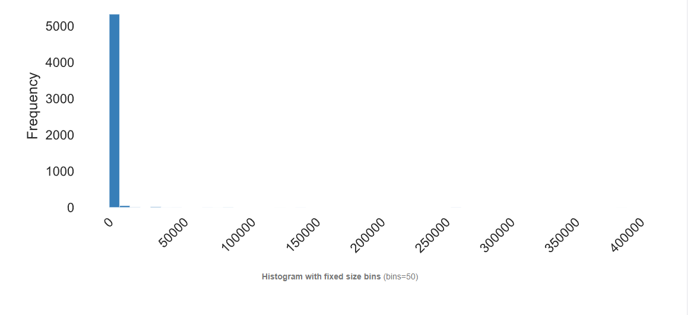

**Title: Distribución de la variable np.log(precio+1)**

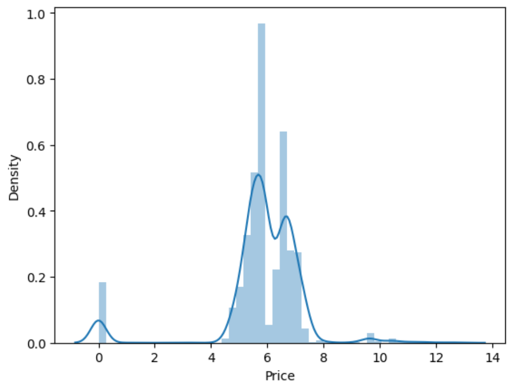

Se procedió con un análisis de las distribuciones de datos, tanto en su forma cruda como después de las transformaciones realizadas. Este análisis permitió visualizar la efectividad de las transformaciones aplicadas y su impacto en la estructura de los datos.

### Loss Reason

Además, se llevó a cabo un exhaustivo análisis exploratorio de la nulidad de los datos. En particular, se examinó la variable "loss_reason", y se identificó una correlación de 1 mediante la correlación de Cramér con la variable "status". Esta alta correlación, respaldada por la naturaleza y los valores de la variable, sugirió que "loss_reason" era un registro de las razones por las cuales un cliente no adquirió el producto. Se realizó un experimento entrenando modelos con esta variable, y se observó que los modelos generaban métricas del AUC cercanas a 0.99. Este hallazgo indicó la presencia de una fuga de datos (data leak) y, en consecuencia, se tomó la decisión de eliminar la variable "loss_reason" del conjunto de datos.

Esta acción se basó en la necesidad de mantener la integridad del modelo y evitar la introducción de información sesgada o filtrada que pudiera afectar la generalización del modelo en entornos del mundo real.

**Title: Heatmap de la matrix de correlación de variables categóricas**

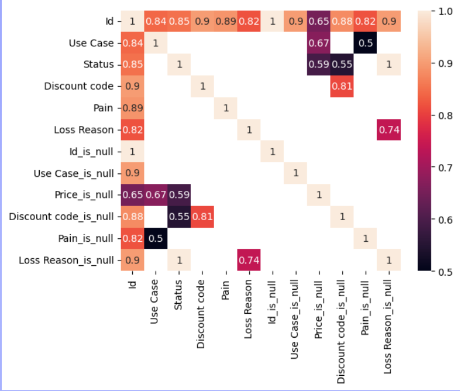

Adicionalmente, se exploró la correlación de la variable "loss_reason" no solo con "status" sino también con las variables "precio" y "discount_code". La correlación identificada con estas variables refuerza la evidencia de que "loss_reason" tenía información crítica para la predicción del modelo y, por lo tanto, su eliminación fue justificada.

### Discount code

En el caso de "discount_code", se observó que, aunque el código en sí mismo no aportaba información útil, la presencia de valores nulos indicaba que el cliente no había recibido un código de descuento. Este hallazgo resultó significativo, ya que se reveló que la existencia de un código de descuento. Como consecuencia, se transformó la variable "discount_code" en una variable binaria que indicaba la presencia o ausencia de un código de descuento, facilitando así la interpretación y aplicación efectiva en el modelo.

**Title: Distribución de la variable has Discount code**

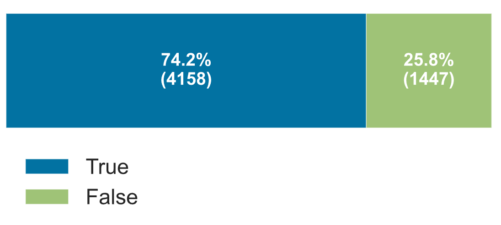

### Open date y closed date

La siguiente fase del análisis se centró en las variables "open_date" y "closed_date". A partir de estas, se derivó una variable adicional de gran relevancia: la duración. La duración se define como la diferencia en días entre la fecha de cierre y la fecha de apertura de la oportunidad de negocio. Durante este proceso, se identificaron valores negativos, interpretados como el tiempo de duración de la oferta. Se consideró que estos datos podrían deberse a errores de digitación, dado que no se contaba con información sobre la forma de adquisición de los datos.

Aunque en una etapa inicial no se tiene información sobre el tiempo real de negociación, la creación de la variable de duración permitirá realizar análisis posteriores para comprender si los clientes requieren tiempo adicional para entender el producto o adquirir más información. Este análisis también podría ayudar a determinar si es posible llevar a cabo una negociación de manera inmediata. En esencia, se trata de alinear el horario del equipo comercial con las necesidades y comportamientos de los clientes.

**Title: Distribución de la variable duración**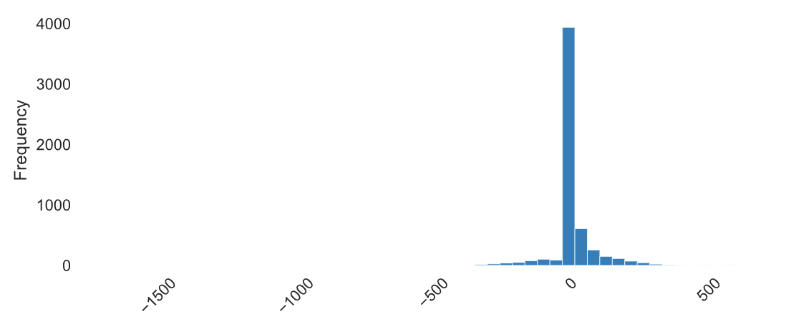

Al explorar la distribución de la variable de duración, se observó que la métrica se ubicaba alrededor de 0, con valores comprendidos principalmente entre -500 y 500. Esta característica refuerza la hipótesis de que los valores negativos podrían deberse a errores de digitación o a una interpretación inadecuada de los datos. La presencia de valores centrados en torno a 0 indica que, en su mayoría, las oportunidades de negocio tenían una duración relativamente corta o nula, lo cual puede ser atribuible a la inmediatez en las transacciones o a la falta de información adicional.

A pesar de la incertidumbre inicial sobre la autenticidad de estos valores, el análisis posterior demostró que la variable de duración desempeñaba un papel crucial en la mejora de las métricas del modelo. Esta información respalda la decisión de retener la variable, incluso con la presencia de valores atípicos, ya que contribuye significativamente a la capacidad predictiva del modelo en cuanto al cierre exitoso de oportunidades de negocio.

### Pain

La variable "Pain" siguió un proceso similar en términos de transformación. Se decidió convertirla en una variable booleana para simplificar su representación. En esta nueva formulación, se asignó el valor "True" a las instancias que involucraban operaciones relacionadas con "Pain", mientras que cualquier otro valor se etiquetó como "False".

**Title: Distribución de la variable Pain**

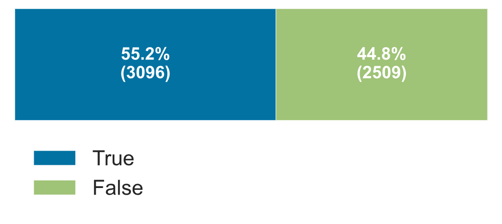

## Dataset lead

Para los datos externos, se procedió a fusionar los conjuntos de datos "lead.csv" y "offers", creando así un dataset más compacto. Este nuevo conjunto de datos fue sometido a un análisis detallado de cada variable, destacando tres de especial importancia: ciudad, Acquisition Campaign, Source y Created Date. Dado el tamaño reducido del conjunto de datos, se evaluó la relevancia de agregar estas variables como características, considerando que su contribución podría ser insignificante en comparación con otras variables.

Para abordar este desafío, se asignó a cada variable información sobre su nulidad, especificando si la oferta provenía de una campaña de adquisición, si estaba asociada a una ciudad o si tenía un objetivo claro. Respecto a "Created Date", se llevó a cabo una transformación restando su valor al de "open_date". Esta operación generó una nueva variable que indicaba el tiempo transcurrido desde que un cliente potencial se convirtió en cliente objetivo, o si el valor era negativo, desde que se le realizó la oferta hasta que se volvió cliente potencial.

Esta estrategia permitió maximizar la utilidad de los datos externos, incorporando información valiosa de manera efectiva en el modelo de entrenamiento. La interpretación de estas variables complementarias se ajustó para adaptarse al contexto de la predicción de cierres exitosos de oportunidades de negocio.

Entre las variables externas analizadas, se identificó que la más relevante para el modelo era la que indicaba si la oferta provenía de un evento corporativo.

**title: Heatmap de correlación de variables categóricas del la unión de los dos datasets**

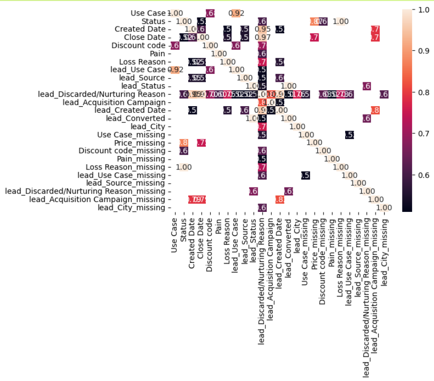

Recordemos que se creó un dataset más pequeño.

## Conclusión

En conclusión, el análisis detallado del primer conjunto de datos reveló que la información única contenida en este conjunto fue fundamental para la identificación de las variables más importantes para el modelo. La ingeniería de características realizada en este conjunto permitió destacar aspectos cruciales, como la presencia de códigos de descuento, la duración de las oportunidades de negocio, y la distinción entre ofertas asociadas a eventos corporativos y otras fuentes.

Aunque se incorporaron datos externos para enriquecer la información, fue el conjunto de datos original el que proporcionó las variables más influyentes para la predicción del modelo. Este descubrimiento subraya la importancia de realizar un análisis minucioso de los datos disponibles y resalta cómo la comprensión profunda de las características específicas de los clientes y las oportunidades puede ser clave para el éxito del modelo de predicción. En adelante, la implementación de estas variables fundamentales en el modelo debería mejorar significativamente su capacidad para prever el cierre exitoso de oportunidades de negocio.

Todo el análisis e información que incontraba, lo llevaba en un tableró de miro. Es muy visual y ayuda al equipo a unir y dejar preguntas

[Whiteboard-miro](https://miro.com/app/board/uXjVMflpEIs=/?share_link_id=43714105302)

# Pipelines de preprocesamiento

Dentro de la estructura del proyecto, se han diseñado cuatro pipelines que siguen el concepto ETL (Extract, Transform, Load). Cada uno de estos pipelines se encarga de manejar una etapa específica del proceso, garantizando así la modularidad y la flexibilidad en la ejecución del flujo de trabajo. Los pipelines se encuentran organizados en la carpeta "src" del proyecto, como se detalla a continuación:

```

└── 📁src
    └── integrated.py
    └── join_datasets.py
    └── preprocessing.py
    └── train.py
    └── utils.py
```

1. **preprocessing.py:** Este pipeline se encarga de realizar el preprocesamiento del dataset "offers.csv". Lee el conjunto de datos desde la ruta "datasets/raw/offers.csv" y guarda la versión transformada en "datasets/processed/offers.csv". Aquí se aplican las distintas transformaciones y manipulaciones de variables necesarias para preparar los datos para el entrenamiento del modelo.
2. **integrate_datasets.py:** Este pipeline se enfoca en el preprocesamiento del dataset "lead.csv". Similar al pipeline de "preprocessing.py", toma el dataset desde "datasets/raw/lead.csv" y guarda la versión transformada en "datasets/processed/lead.csv". Se aplican las transformaciones específicas a este conjunto de datos.
3. **join_datasets.py:** Este pipeline se encarga de la integración de los dos datasets preprocesados, "offers.csv" y "lead.csv". Lee ambos conjuntos de datos desde sus rutas procesadas respectivas y los une en un único dataset. El dataset integrado se guarda en "datasets/processed/integrated_dataset.csv".
4. **train_model.py:** Este pipeline representa la etapa de entrenamiento del modelo. Utiliza el dataset integrado generado por el pipeline anterior y realiza el entrenamiento del modelo. Los modelos entrenados se almacenan para su uso posterior en el proceso de predicción.

Esta organización modular y la ubicación de los datasets en carpetas específicas facilitan la integración del proyecto con administradores de tareas como Apache Airflow o prefect, permitiendo la automatización y programación del flujo de trabajo. Además, la estructura del proyecto facilita su mantenimiento y escalabilidad a medida que se incorporan más funciones y se expande el alcance del proyecto.

Cada uno de los pipelines anteriormente mencionados crea automáticamente un informe que se almacena en la carpeta "reports".

```

└── 📁reports

    └── integrated.html

    └── leads.html

    └── offer.html

```

También, cada pipeline cuenta con su propio conjunto de pruebas unitarias, siguiendo una filosofía de MLOps de integración continua.

```

└── 📁test

    └── 📁datasets

    └── test_integrated.py

    └── test_preprocessing.py

    └── test_train.py

    └── tets_join_datasets.py

    └── __init__.py

```

## Entranamiento del modelo

El entrenamiento parte del hecho de que contamos con un conjunto de datos llamado "integrated" dentro de la carpeta "datasets/processes". Para abordar los datos nulos, se realizará una imputación utilizando la moda en el caso de variables categóricas y la media si son numéricas.

El proceso de entrenamiento constará de dos fases, ambas llevadas a cabo con el framework PyCaret. Este framework ofrece una amplia integración con diversos modelos y proporciona orientación sobre qué modelo utilizar en función de la métrica seleccionada. En este caso, la métrica elegida es el AUC (Area Under the Curve), ya que se busca que el modelo pueda identificar tanto la clase 0 como la clase 1, siendo este el objetivo del programa.

Para orquestar todo el proceso, se emplea MLflow. La finalidad es tener un repositorio que muestre los diferentes experimentos realizados y que siempre esté disponible el mejor modelo para su uso, ya sea a través de una API u otros medios. Todas las variables categóricas se convertirán a datos numéricos mediante label encoding, y de manera interna, PyCaret realizará la conversión a one-hot encoding.

Este enfoque integrado y automatizado proporciona una base sólida para la creación y selección de modelos, garantizando que se utilice el mejor modelo entrenado para el cumplimiento del objetivo del programa. La implementación de MLflow facilita la gestión y rastreo de experimentos, lo que contribuye a la transparencia y reproducibilidad de los resultados obtenidos en el proceso de entrenamiento.

PyCaret nos proporcionará un modelo previamente entrenado con diversas arquitecturas. Esta característica nos brinda la flexibilidad de contar con un modelo listo para la producción, alineándonos con una metodología ágil. Posteriormente, se llevará a cabo un ajuste de los hiperparámetros del modelo con el fin de seleccionar los valores óptimos. Es importante destacar que todo este proceso se realiza utilizando cross-validation de 10 pliegues, lo cual contribuye a evitar el sobreajuste del modelo.

Este enfoque garantiza que el modelo esté bien generalizado y pueda realizar predicciones robustas en datos nuevos. La elección cuidadosa de los hiperparámetros a través del ajuste y la validación cruzada mejora la capacidad del modelo para adaptarse a diferentes conjuntos de datos, aumentando su rendimiento en condiciones del mundo real.

### Métricas de experimento

Cabe resaltar que todos los experimentos dan una mayor métrica GradientBoostingClassifier

Un primer experimento está plasmado en la carpeta notebooks 1-1 train_all.py

**title: Roc for train model**

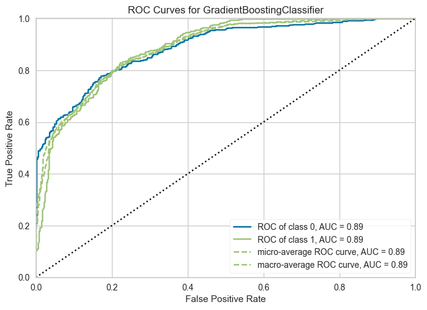

podemos ver que obtenemos una métrica de un AUC = 0.88, algo bueno para nuestro modelo

**Title: Importancia de las variables del modelo**

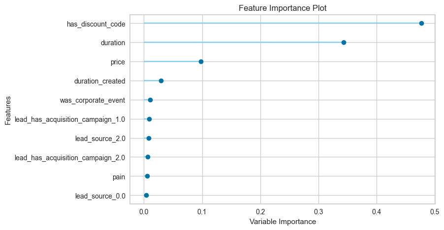

También vemos las variables de mayor importancia, las cuales son has_discount_code, duration y price.

Veamos las métricas con el dataset de testeo.

**Title: Curva ROC en testeo**

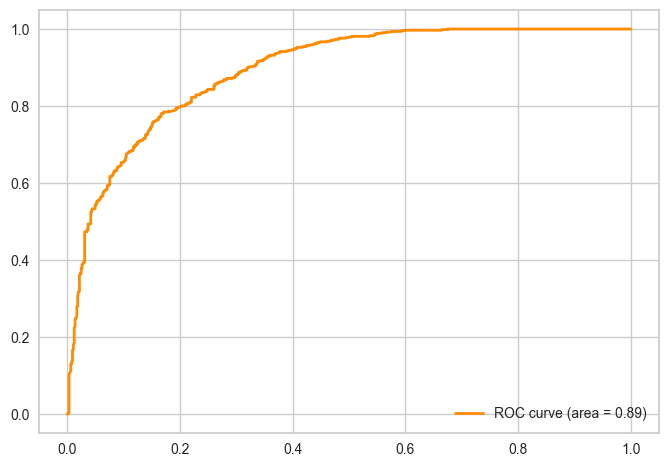

Como se puede observar, tanto el AUC de entrenamiento con cross-validation (cv=10) como el AUC de prueba son iguales. Este hecho refleja aspectos cruciales del rendimiento del modelo, ya que demuestra su capacidad para diferenciar eficazmente entre las dos clases objetivo

**Matriz de confusión en testeo**

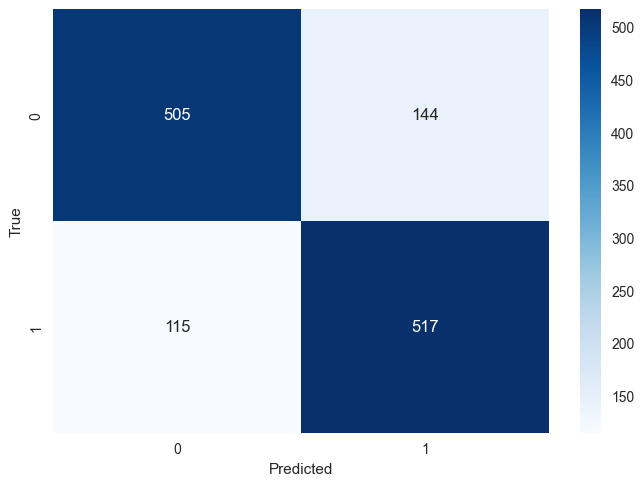

Todos los experimentos se encuentran en la carpeta notebooks.

└── 📁notebooks

    └── 1-1  train_all.ipynb

    └── 1-2 train_accurracy.ipynb

    └── 1-3  train_drop_isnull.ipynb

    └── logs.log

En esta fase, se llevaron a cabo tres experimentos distintos. En el primer experimento, se introdujo una nueva columna de características indicando si los datos son artificiales.

Los experimentos 1.1 y 1.3 mostraron similitudes significativas en términos de métricas de rendimiento. Sin embargo, al examinar las curvas de aprendizaje, se identificó una tendencia preocupante en los modelos de tipo árbol, específicamente en el Gradient Boosting Classifier (GBC), hacia el sobreajuste. Este fenómeno se manifiesta de manera más evidente en el GBC.

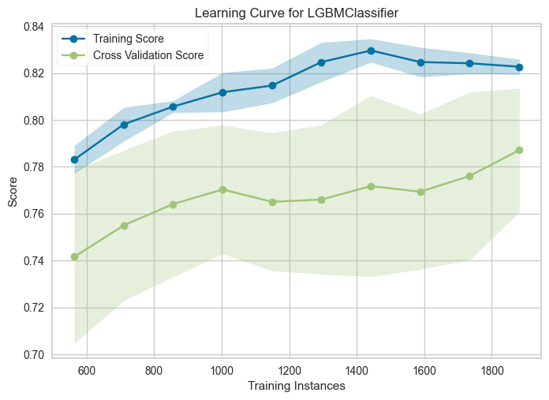

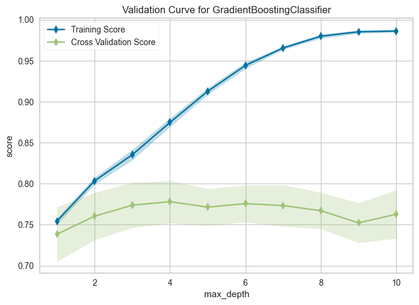

En vista de los resultados obtenidos y la observación de tendencias de sobreajuste en modelos de tipo árbol, se ha tomado la decisión de seleccionar el **LGBMClassifier** como el modelo preferido. Este modelo ha demostrado un rendimiento sólido y ha evitado los desafíos asociados con el sobreajuste que se observaron en otros modelos, especialmente en el Gradient Boosting Classifier (GBC).

La elección del LGBMClassifier se respalda no solo en su rendimiento general, sino también en su capacidad para manejar eficientemente conjuntos de datos más grandes y complejos, así como su eficacia en términos de tiempo de entrenamiento. Este modelo proporciona una combinación equilibrada de velocidad y rendimiento, lo que lo hace adecuado para su implementación en entornos de producción.

### Métricas del modelo óptimo

**Title: Roc Curver en entrenamiento con cv=10**

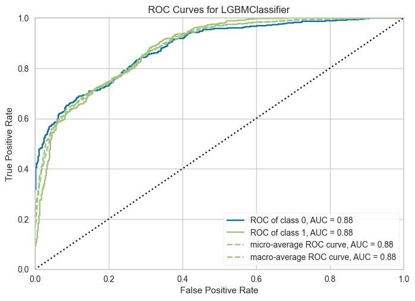

**Title: Variables importantes**

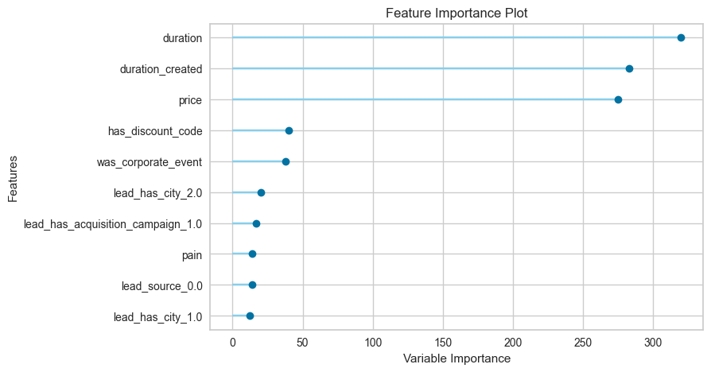

**Title: Matriz de confución con los datos de testeo**

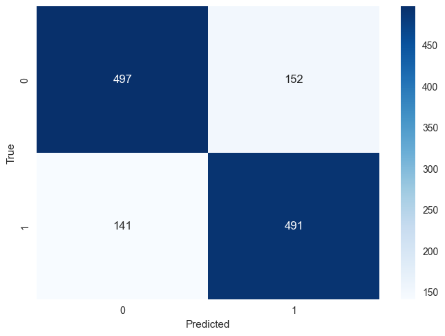

**Title: Roc Curve con los datos de testeo**

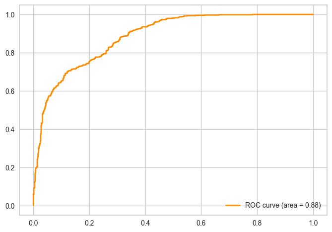

### Conclusión

En resumen, observamos que nuestra métrica de interés, el AUC, tanto en la fase de entrenamiento como en la de prueba, muestra similitudes significativas. Este resultado indica que el modelo seleccionado, el LGBMClassifier.

Además, se destaca la relevancia de la variable "duration". Aunque inicialmente no disponemos de información sobre la duración de la oferta, esta variable ha demostrado ser crucial en el proceso de modelado. La capacidad para analizar la duración ofrece un margen de maniobra valioso para comprender el comportamiento del cliente y determinar el momento óptimo para cerrar una oferta. Esta flexibilidad en el tiempo de permanencia de la oferta abierta agrega un elemento estratégico y adaptativo al proceso de toma de decisiones.

# Continuación

1. **Creación del Pipeline de Implementación Continua (CD):**
   * Se procederá a desarrollar un pipeline de implementación continua que permita el despliegue automático del modelo en entornos de producción. Este proceso garantizará que el modelo seleccionado esté disponible y listo para su uso de manera eficiente.
2. **Monitoreo Continuo del Modelo:**
   * La fase de monitoreo constante será una parte integral del proceso. Se llevarán a cabo pruebas regulares de KS-divergente para identificar posibles cambios en la distribución de datos y señales de data drift. La predicción de métricas futuras contribuirá a una mejor comprensión del rendimiento del modelo a lo largo del tiempo, facilitando la toma de decisiones informadas sobre la necesidad de reentrenamiento con nuevos datos.
3. **Utilización de Frameworks como Evidently y Grafana:**
   * Se emplearán herramientas como el framework Evidently y Grafana para facilitar el monitoreo del modelo. Evidently permitirá realizar análisis detallados de la calidad del modelo, mientras que Grafana ofrecerá una interfaz visual para el seguimiento y la visualización de métricas clave. Esta combinación de herramientas mejorará la capacidad para detectar patrones inesperados o problemas de rendimiento, permitiendo ajustes y mejoras proactivas en el modelo.

Este enfoque integral garantizará no solo la implementación exitosa del modelo en producción, sino también su mantenimiento y mejora continua en respuesta a los cambios en los datos y en el entorno del problema. La atención constante al monitoreo y la adaptabilidad son esenciales para asegurar que el modelo siga siendo efectivo a lo largo del tiempo.

# Vista del usario final

Al final el usario verá un dashboard con metadatos e información de la predición de Shimoku.

al principio el usuario va a ver las predicciones positivas totales


Una gráfica de pie sobre la información de las etiquetas predichas

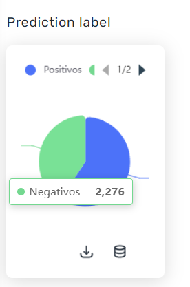


Una tabla con el id, la predicción y la variable más importante

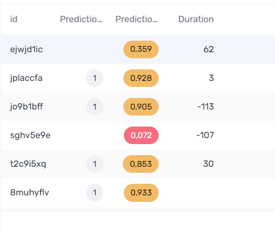

y por ultimo el usario verá las carecteristicas más importantes

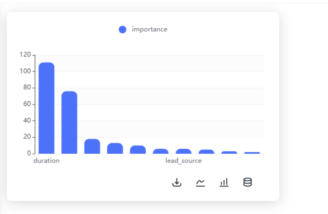

La idea es que dentro de Shimoku, haya otro dashboard para el equipo interno. Por lo que vi leyendo la documentación, está muy pensado para inteligencia de negocio y usarios finales, por eso es que no quise incluir los outputs de los pipelines. Igualmente por buena práctica es bueno que se hecha pero un dashboard interno.
