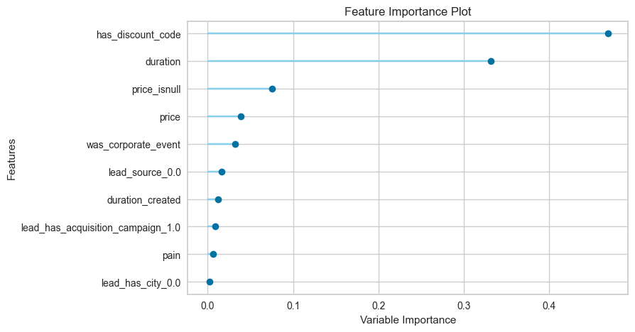

# Informe  de entrenamiento

# Ingeniería de características

## datasets offers.csv

En el proceso inicial del entrenamiento del modelo, se llevó a cabo la ingeniería de características como primer paso. Para esto, se realizaron tres análisis exploratorios con el objetivo de comprender las características del negocio. En primer lugar, se examinó el conjunto de datos, realizando un análisis detallado de cada columna y su posible relación con la variable predictora.

### Status

El enfoque inicial consistió en analizar la variable objetivo, donde se procedió a examinar todas las clases disponibles. Como resultado de este análisis, se tomó la decisión de mantener las clases "Closed Won" y "Closed Loss". Esta elección se basó en la capacidad de estas clases para describir de manera precisa el objetivo del modelo, que es proporcionar un puntaje que varía entre 0 y 1. En este contexto, el valor 0 representa la probabilidad de perder un cierre, mientras que el valor 1 indica la probabilidad de lograr un cierre exitoso. Este enfoque busca optimizar la capacidad del modelo para realizar un scoring efectivo en la clasificación de oportunidades de negocio.

**Title: Distribución de la variable status**

Tras realizar este proceso, se observó que el 57.9% de las instancias pertenecían a la clase "Closed Won" y el 42.1% a la clase "Closed Loss". Este equilibrio en la distribución de clases indicó que no existía un desbalanceo significativo en los datos. Con esta consideración, se procedió a eliminar los datos relacionados con la otra clase, consolidando así un conjunto de datos más enfocado y representativo para el objetivo del modelo.

### Use Case

La segunda variable analizada fue "use_case". Este análisis proporcionó una comprensión más profunda del caso de uso de la plataforma. Los resultados indicaron una fuerte asociación con eventos corporativos. En consecuencia, se tomó la decisión de crear una variable binaria para clasificar los casos como eventos corporativos y eventos no corporativos. Esta nueva variable binaria se introdujo con el objetivo de capturar y reflejar de manera más efectiva la naturaleza específica de los eventos corporativos en relación con el rendimiento del modelo.

**Title: Distribución de la variable use case**

La evaluación de la variable "use_case" reveló que no existía un desbalanceo significativo, y se destacó su predominante aplicación en eventos corporativos.

### Precio

Posteriormente, la atención se centró en la variable de "precio". Durante el análisis, se identificaron varios valores iguales a cero, sugiriendo que algunos clientes habían obtenido servicios de manera gratuita. Aunque la distribución de esta variable mostraba un sesgo hacia la izquierda, se determinó que no tenía un impacto sustancial en la métrica de AUC, la cual se explicará más adelante por qué fue seleccionada como métrica principal. Se realizaron pruebas con correcciones utilizando logaritmos y normalización, sin embargo, se observó que estas modificaciones no generaban cambios significativos en la métrica AUC.

**Title: Distribución de la variable precio**

**Title: Distribución de la variable np.log(precio+1)**

Se procedió con un análisis de las distribuciones de datos, tanto en su forma cruda como después de las transformaciones realizadas. Este análisis permitió visualizar la efectividad de las transformaciones aplicadas y su impacto en la estructura de los datos.

### Loss Reason

Además, se llevó a cabo un exhaustivo análisis exploratorio de la nulidad de los datos. En particular, se examinó la variable "loss_reason", y se identificó una correlación de 1 mediante la correlación de Cramér con la variable "status". Esta alta correlación, respaldada por la naturaleza y los valores de la variable, sugirió que "loss_reason" era un registro de las razones por las cuales un cliente no adquirió el producto. Se realizó un experimento entrenando modelos con esta variable, y se observó que los modelos generaban métricas del AUC cercanas a 0.99. Este hallazgo indicó la presencia de una fuga de datos (data leak) y, en consecuencia, se tomó la decisión de eliminar la variable "loss_reason" del conjunto de datos.

Esta acción se basó en la necesidad de mantener la integridad del modelo y evitar la introducción de información sesgada o filtrada que pudiera afectar la generalización del modelo en entornos del mundo real.

**Title: Heatmap de la matrix de correlación de variables categóricas**

Adicionalmente, se exploró la correlación de la variable "loss_reason" no solo con "status" sino también con las variables "precio" y "discount_code". La correlación identificada con estas variables refuerza la evidencia de que "loss_reason" tenía información crítica para la predicción del modelo y, por lo tanto, su eliminación fue justificada.

### Discount code

En el caso de "discount_code", se observó que, aunque el código en sí mismo no aportaba información útil, la presencia de valores nulos indicaba que el cliente no había recibido un código de descuento. Este hallazgo resultó significativo, ya que se reveló que la existencia de un código de descuento era una variable crucial para el modelo. Como consecuencia, se transformó la variable "discount_code" en una variable binaria que indicaba la presencia o ausencia de un código de descuento, facilitando así la interpretación y aplicación efectiva en el modelo.

Esta transformación permitió mantener la información esencial relacionada con los descuentos sin comprometer la calidad del modelo, al tiempo que se simplificaba la representación de la variable para una mejor compatibilidad con el proceso de entrenamiento.

**Title: Distribución de la variable has Discount code**

### Open date y closed date

La siguiente fase del análisis se centró en las variables "open_date" y "closed_date". A partir de estas, se derivó una variable adicional de gran relevancia: la duración. La duración se define como la diferencia en días entre la fecha de cierre y la fecha de apertura de la oportunidad de negocio. Durante este proceso, se identificaron valores negativos, interpretados como el tiempo de duración de la oferta. Se consideró que estos datos podrían deberse a errores de digitación, dado que no se contaba con información sobre la forma de adquisición de los datos.

Aunque en una etapa inicial no se tiene información sobre el tiempo real de negociación, la creación de la variable de duración permitirá realizar análisis posteriores para comprender si los clientes requieren tiempo adicional para entender el producto o adquirir más información. Este análisis también podría ayudar a determinar si es posible llevar a cabo una negociación de manera inmediata. En esencia, se trata de alinear el horario del equipo comercial con las necesidades y comportamientos de los clientes.

Es importante destacar que se entrenaron los modelos tanto con la variable de duración como sin ella. La eliminación de esta variable resultó en una disminución significativa, del orden del 10%, en las métricas del modelo, resaltando así su relevancia en la predicción del rendimiento de las oportunidades de negocio.

La siguiente fase del análisis se centró en las variables "open_date" y "closed_date". A partir de estas, se derivó una variable adicional de gran relevancia: la duración. La duración se define como la diferencia en días entre la fecha de cierre y la fecha de apertura de la oportunidad de negocio. Durante este proceso, se identificaron valores negativos, interpretados como el tiempo de duración de la oferta. Se consideró que estos datos podrían deberse a errores de digitación, dado que no se contaba con información sobre la forma de adquisición de los datos.

Aunque en una etapa inicial no se tiene información sobre el tiempo real de negociación, la creación de la variable de duración permitirá realizar análisis posteriores para comprender si los clientes requieren tiempo adicional para entender el producto o adquirir más información. Este análisis también podría ayudar a determinar si es posible llevar a cabo una negociación de manera inmediata. En esencia, se trata de alinear el horario del equipo comercial con las necesidades y comportamientos de los clientes.

Es importante destacar que se entrenaron los modelos tanto con la variable de duración como sin ella. La eliminación de esta variable resultó en una disminución significativa, del orden del 10%, en las métricas del modelo, resaltando así su relevancia en la predicción del rendimiento de las oportunidades de negocio.

**Title: Distribución de la variable duración**

Al explorar la distribución de la variable de duración, se observó que la métrica se ubicaba alrededor de 0, con valores comprendidos principalmente entre -500 y 500. Esta característica refuerza la hipótesis de que los valores negativos podrían deberse a errores de digitación o a una interpretación inadecuada de los datos. La presencia de valores centrados en torno a 0 indica que, en su mayoría, las oportunidades de negocio tenían una duración relativamente corta o nula, lo cual puede ser atribuible a la inmediatez en las transacciones o a la falta de información adicional.

A pesar de la incertidumbre inicial sobre la autenticidad de estos valores, el análisis posterior demostró que la variable de duración desempeñaba un papel crucial en la mejora de las métricas del modelo. Esta información respalda la decisión de retener la variable, incluso con la presencia de valores atípicos, ya que contribuye significativamente a la capacidad predictiva del modelo en cuanto al cierre exitoso de oportunidades de negocio.

**Title: AUC de dataset de testeo sin la variable duración**

Podemos ver que el AUC sin está varaiable baja a un 0.82% cuando teniendo está variable se  llega a un 0.92%

**Title: AUC de dataset de testeo con la variable duración**

### Pain

La variable "Pain" siguió un proceso similar en términos de transformación. Se decidió convertirla en una variable booleana para simplificar su representación. En esta nueva formulación, se asignó el valor "True" a las instancias que involucraban operaciones relacionadas con "Pain", mientras que cualquier otro valor se etiquetó como "False".

**Title: Distribución de la variable Pain**

## Dataset lead

Para los datos externos, se procedió a fusionar los conjuntos de datos "lead.csv" y "offers", creando así un dataset más compacto. Este nuevo conjunto de datos fue sometido a un análisis detallado de cada variable, destacando tres de especial importancia: ciudad, Acquisition Campaign, Source y Created Date. Dado el tamaño reducido del conjunto de datos, se evaluó la relevancia de agregar estas variables como características, considerando que su contribución podría ser insignificante en comparación con otras variables.

Para abordar este desafío, se asignó a cada variable información sobre su nulidad, especificando si la oferta provenía de una campaña de adquisición, si estaba asociada a una ciudad o si tenía un objetivo claro. Respecto a "Created Date", se llevó a cabo una transformación restando su valor al de "open_date". Esta operación generó una nueva variable que indicaba el tiempo transcurrido desde que un cliente potencial se convirtió en cliente objetivo, o si el valor era negativo, desde que se le realizó la oferta hasta que se volvió cliente potencial.

Esta estrategia permitió maximizar la utilidad de los datos externos, incorporando información valiosa de manera efectiva en el modelo de entrenamiento. La interpretación de estas variables complementarias se ajustó para adaptarse al contexto de la predicción de cierres exitosos de oportunidades de negocio.

Entre las variables externas analizadas, se identificó que la más relevante para el modelo era la que indicaba si la oferta provenía de un evento corporativo.

**title: Heatmap de correlación de variables categóricas del la unión de los dos datasets**

Recordemos que se creó un dataset más pequeño.

**title: Importancia de variables para el modelo.**

podemos identifica la variable was_corporate_event como la 5 de mayor importancia para el modelo.

## Conclusión

En conclusión, el análisis detallado del primer conjunto de datos reveló que la información única contenida en este conjunto fue fundamental para la identificación de las variables más importantes para el modelo. La ingeniería de características realizada en este conjunto permitió destacar aspectos cruciales, como la presencia de códigos de descuento, la duración de las oportunidades de negocio, y la distinción entre ofertas asociadas a eventos corporativos y otras fuentes.

Aunque se incorporaron datos externos para enriquecer la información, fue el conjunto de datos original el que proporcionó las variables más influyentes para la predicción del modelo. Este descubrimiento subraya la importancia de realizar un análisis minucioso de los datos disponibles y resalta cómo la comprensión profunda de las características específicas de los clientes y las oportunidades puede ser clave para el éxito del modelo de predicción. En adelante, la implementación de estas variables fundamentales en el modelo debería mejorar significativamente su capacidad para prever el cierre exitoso de oportunidades de negocio.

Todo el análisis e información que incontraba, lo llevaba en un tableró de miro. Es muy visual y ayuda al equipo a unir y dejar preguntas

[Whiteboard-miro](https://miro.com/app/board/uXjVMflpEIs=/?share_link_id=43714105302)

## Pipelines de preprocesamiento

Dentro de de los notes del 0-1 al 0-3 fue el análisis
